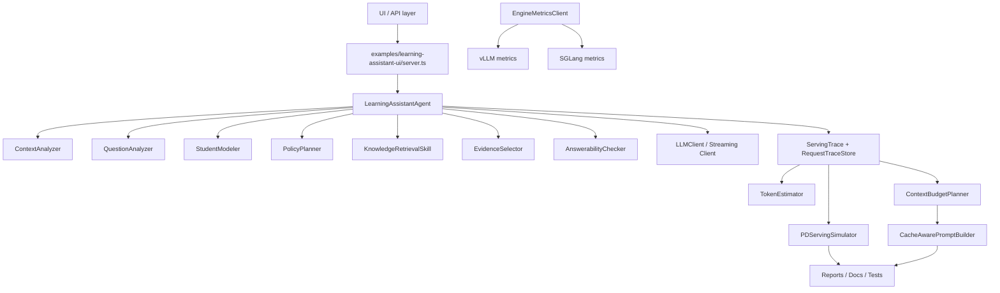

# LEARN_AGENT 项目完整说明书

**副标题：** 一个面向教育 Agent Workload 的 Cache-aware / PD-aware LLM Serving Research Harness

**日期：** 2026-05-20

**作者：** Project Owner

**当前状态：** Research Artifact Ready / Final Editing Pass

---

## 1. 一句话介绍项目

LEARN_AGENT 最初是一个能读取 PPT 当前页并回答学生问题的教育助教，现在已经扩展成一个研究型工程作品：它把教育 agent 的长上下文、证据检索、prompt 构造、prefill/decode cost、prefix caching、PD serving simulator、vLLM/SGLang engine bridge 放在同一个可测试框架里。

换句话说，它不是简单 RAG demo，而是一个教育 agent workload 上的 LLM serving research harness。

## 2. 项目不是什么

- 它不是 vLLM 或 SGLang 的替代品。
- 它没有在当前硬件环境里完成真实 GPU-level PD disaggregation。
- dry-run benchmark 不代表真实 latency。
- simulator 不是 GPU benchmark。
- quality proxy 不是人工答案质量评价。
- 当前默认报告不会声称真实 TTFT、ITL、E2E 或真实 SLO goodput。

## 3. 为什么这个项目有研究价值

教育 agent 天然具有长上下文：当前 PPT 页、教师讲稿、大纲、学习者画像、聊天历史、检索证据、引用规则和输出格式都会进入 prompt。这些内容会显著影响 prefill cost。

同时，同一课程、同一页面、同一课堂中的多轮问答会共享大量 prefix。例如 system policy、课程大纲、当前页内容、教师讲稿经常稳定不变，只有学生问题和少量 evidence 是动态的。因此它适合研究：

- prefix caching 是否能降低重复 prefill 成本；
- cache-aware prompt layout 是否能让 stable prefix byte-for-byte 稳定；
- context budget 是否能在不破坏 grounding 的情况下减少 prefill tokens；
- PD 分离场景下 prefill queue、decode queue 和 KV transfer 的 tradeoff；
- 应用层 workload shaping 如何配合 vLLM/SGLang 这样的真实推理引擎。

在没有 GPU 的情况下，trace-driven simulator 和 optional engine bridge 是合理的阶段性方案：先把 workload、trace、指标口径和实验脚手架搭好，等有 GPU 后再接真实 engine 校准。

## 4. 系统总览

### 4.1 模块图



### 4.2 核心层次

| 层次 | 作用 | 关键文件 |
| --- | --- | --- |
| UI/API | 接收用户问题、材料、模型配置，返回 answer 和 trace。 | examples/learning-assistant-ui/server.ts |
| Education Agent | 分析上下文、检索证据、判断可回答性、生成回答。 | LearningAssistantAgent.ts |
| Grounding | 决定证据是否足够，避免编造。 | EvidenceSelector.ts, AnswerabilityChecker.ts |
| Serving Trace | 记录 phase latency、token estimate、context cost。 | ServingTrace.ts, PhaseTimer.ts, TokenEstimator.ts |
| PD Simulator | 对 monolithic / PD / hybrid 做 trace-driven what-if。 | PDServingSimulator.ts |
| Engine Bridge | 可选接 vLLM/SGLang/OpenAI-compatible endpoint。 | StreamingOpenAICompatibleClient.ts, EngineMetricsClient.ts |
| Benchmark | 生成 dry-run 或真实 endpoint benchmark report。 | run-engine-benchmark.ts |
| Docs/Tests | 说明项目边界并防止误导性报告。 | docs/, tests/serving/ |

## 5. 一次 /api/ask 的完整调用链

一次问答请求大致经过：

```text
request
  -> buildContext
  -> agent.answer
  -> analyzeContext
  -> analyzeQuestion
  -> inferLearnerState
  -> planPolicy
  -> retrieveEvidence
  -> selectEvidence
  -> checkAnswerability
  -> buildPrompt
  -> generateAnswer
  -> attachServingTrace
  -> response
```

### 5.1 server.ts

UI server 接收 /api/ask 请求，读取当前 material、pageIndex、learner profile、chat history、LLM 配置和 serving 配置。它负责构造 LearningContext，并创建 LearningAssistantAgent。

### 5.2 LearningAssistantAgent.answer

Agent 不是直接把问题扔给 LLM，而是先拆成多个可观察阶段：context analysis、question analysis、student modeling、policy planning、retrieval、evidence selection、answerability check、prompt build、LLM/fallback generation。每个阶段都可以被 PhaseTimer 记录。

### 5.3 Evidence 和 answerability

Agent 只把真正相关的 current page、teacher script、outline、neighbor page、wiki evidence 放入 selected evidence。对于公式、预算、精确数值、实验数据等问题，如果没有明确证据，就应该拒绝编造。

### 5.4 Serving trace

回答生成后，系统附加 servingTrace，包括 requestId、tokenEstimate、latencyMs、simulatedPD、contextBudgetSuggestion、retrievalStatus、selectedEvidenceCount、confidence 等。trace 不保存 raw prompt、raw answer、API key。

## 6. 教育 Agent 设计

普通 chatbot 往往只看用户当前一句话；LEARN_AGENT 的教育 agent 需要理解当前学习页面、课程上下文、教师讲稿、学习者状态和历史对话。

| 设计点 | 为什么需要 |
| --- | --- |
| Answerability | 明确问题是否能从当前资料回答，防止幻觉。 |
| Citations | 告诉用户答案依据来自当前页、讲稿、wiki 或通用知识。 |
| Confidence | 给 UI 和评测一个粗粒度可信度信号。 |
| DecisionTrace | 解释 agent 为什么选这个策略和证据。 |
| GenerationDebug | 开发者查看 provider、model、mode、fallback 和证据状态。 |
| Grounding | 课程场景不能为了流畅而编造公式、数据或结论。 |

## 7. Serving Trace 设计

Serving trace 的目标不是记录用户隐私，而是记录性能和成本结构：

- contextAnalysis、questionAnalysis、retrieval、evidenceSelection、answerability、promptBuild、llmWallClock、total latency；
- estimatedPrefillTokens、estimatedDecodeTokens、cacheablePrefixTokens；
- selected evidence token cost；
- simulated TTFT/TPOT/KV transfer；
- context budget suggestion。

它不保存 raw prompt、raw answer、API key，因为这些可能包含学生隐私、课程内容和密钥。报告只保存 hash、长度、统计值和 sourceType 聚合信息。

## 8. TokenEstimator

TokenEstimator 是 deterministic heuristic，不是精确 tokenizer。它用汉字数量、英文单词、数字、标点和混合间隔估算 token 数。

为什么可以先这样做：

- 当前目标是 workload shape 和相对变化，不是 tokenizer 级精确 billing。
- heuristic 可单元测试、无外部依赖、离线可跑。
- 后续接真实 vLLM/SGLang 时，可用 engine usage tokens 或 tokenizer 替换。

未来改进：接 tiktoken、HuggingFace tokenizer 或 vLLM/SGLang 自身 tokenizer 输出。

## 9. PDServingSimulator

### 9.1 基础概念

| 术语 | 含义 |
| --- | --- |
| Prefill | 模型处理 prompt 上下文并生成 KV cache 的阶段。 |
| Decode | 模型逐 token 生成输出的阶段。 |
| TTFT | Time To First Token，首 token 延迟。 |
| ITL/TPOT | Inter-token latency / Time Per Output Token，输出 token 间隔。 |
| E2E latency | 端到端完成时间。 |
| SLO | 服务等级目标，如 TTFT < 800ms。 |
| Goodput | 满足 SLO 的请求比例。dry-run 中不能当真实 goodput。 |

### 9.2 三种策略

| 策略 | 模拟含义 |
| --- | --- |
| monolithic_shared | prefill 和 decode 在同一 worker pool 中争用资源。 |
| pd_disaggregated | 请求先进入 prefill queue，再经过 KV transfer，最后进入 decode queue。 |
| hybrid | 简化的混合策略，近似 cache-aware prefill 和 SLO-aware decode prioritization。 |

这个 simulator 是 trace-driven what-if analysis，不是真实 GPU 结果。报告必须写 Measurement mode: simulated。

## 10. ContextBudgetPlanner

上下文越长，prefill cost 越高。但教育 agent 不能为了省 token 破坏 grounding。ContextBudgetPlanner 默认 observe-only，只给 suggestion，不直接改变答案。

| Policy | 适用场景 | 风险 |
| --- | --- | --- |
| full | 需要完整上下文或证据不确定。 | token cost 高。 |
| evidence_top_k | evidence 很多但 top evidence 足够。 | 可能漏掉弱相关证据。 |
| current_page_only | 问题明确只问当前页。 | 不适合跨页/知识库问题。 |
| compressed | 证据冗长但不要求精确数值。 | 可能损失细节。 |
| cache_first | 同 material/page 多轮重复，追求 stable prefix。 | 单次 prompt 可能更长。 |

## 11. CacheAwarePromptBuilder

CacheAwarePromptBuilder 把 prompt 拆成 components，并尽量让 stable prefix 稳定：system、course policy、outline、current page、teacher script 等放在前面；selected evidence、learner profile、chat history、question 放在后面。

关键点：

- stable prefix 必须 byte-for-byte 稳定；
- requestId、timestamp、随机 debug 信息不能放入 stable prefix；
- 同一 material/page 的 stablePrefixHash 应该不随 question 变化；
- cache_first 可能让单次 prompt 更长，但希望通过 prefix cache 命中摊销成本；
- break-even cache hit rate = extraTokens / reusableTokens。若大于 1，说明在当前 heuristic token model 下需要超过 100% 命中率，不值得直接宣称收益。

## 12. SOTA Engine Bridge

Engine bridge 让项目以后能接真实 engine：

- StreamingOpenAICompatibleClient：调用 /v1/chat/completions stream=true，解析 SSE chunk，记录 TTFT、ITL、E2E。
- PrometheusMetricsParser：解析 /metrics 文本格式。
- VllmMetricsAdapter：归一化 vLLM metrics，如 prefix cache、prompt tokens、generation tokens、TTFT、ITL。
- SglangMetricsAdapter：归一化 SGLang metrics，如 cache hit rate、token usage、running reqs。
- EngineBenchmarkRunner：对 full、evidence_top_k、current_page_only、cache_first replay workload。

如果 endpoint 不支持 streaming，只能记录 full response wall-clock，不能伪造 TTFT/ITL。如果没有 /metrics，就不能报告真实 prefix cache hit。

## 13. vLLM / SGLang 的关系

vLLM/SGLang 是真实推理引擎，本项目是 workload / application / benchmark harness。本项目不重写 PagedAttention、RadixAttention、continuous batching 或 KV cache manager。它研究的是应用层 prompt/context assembly 如何更适合这些 engine。

## 14. 当前实验结果怎么读

| 命令 | 当前含义 |
| --- | --- |
| npm run test:serving | serving 模块、report truthfulness、engine bridge 解析、cache prompt tests 通过。 |
| npm test | 原教育 agent 主功能通过，说明研究层没有破坏主链路。 |
| npm run simulate:pd | 生成 estimated/simulated PD what-if report。 |
| npm run benchmark:engine | dry-run，只验证 workload shape 和 prompt accounting。 |
| npm run verify:final | 统一跑最终检查和安全扫描。 |

TTFT/ITL/E2E 在 dry-run 中显示 n/a 是正确的，因为没有真实 streaming endpoint。dry-run 里的 Workload success 不能解释为 actual SLO goodput。

## 15. 项目文件结构

```text
- 测试集/
  - 测试PPT/
    - 赵健凯-20220920-中期答辩.pptx
    - 最终_中期答辩.pptx
    - test1.pptx
    - test2.pptx
- docs/
  - competition-positioning.md
  - final-research-report.md
  - LEARN_AGENT_项目完整说明书.docx
  - LEARN_AGENT_项目完整说明书.md
  - learning-guide.md
  - pd-results.md
  - pd-serving-lab.md
  - sota-engine-bridge.md
- Education_LLM_Wiki_Operating_Package/
  - Education_LLM_Wiki_Operating_Package/
    - 00_Start_Here/
      - README.md
    - 01_Learning_Maps/
    - 02_Core_Concepts/
    - 03_Source_Notes/
    - 04_Insights/
    - 05_Query_Feedback/
      - Query_Inbox.md
    - 90_Raw_Sources/
    - 99_System/
      - Skills/
        - answer_query_and_writeback.md
        - compile_wiki_pages.md
        - ingest_and_parse_source.md
        - integrate_and_record.md
        - lint_and_repair_wiki.md
      - Templates/
        - Core_Concept_Template.md
        - Global_Frontmatter_Template.md
        - Index_Template.md
        - Insight_Template.md
        - Learning_Map_Template.md
        - Lint_Report_Template.md
        - Log_Template.md
        - Query_Feedback_Template.md
        - Source_Note_Template.md
      - Lint_Report.md
    - AGENTS.md
    - index.md
    - log.md
    - README_PACKAGE.md
- examples/
  - future-school-demo/
    - mock-students.json
    - run-future-school-demo.ts
  - learning-assistant-demo/
    - run-demo.ts
    - sample-material.md
  - learning-assistant-ui/
    - public/
      - assets/
        - future-school-demo-ui.png
      - app.js
      - competition.html
      - index.html
      - styles.css
    - server.ts
  - learning-loop-demo/
    - mock-class-session.json
    - README.md
    - run-learning-loop-demo.ts
- pptx2md/
  - pptx2md/
    - spec/
      - metadata_spec.md
      - metadata.example.json
      - metadata.schema.json
    - src/
      - pptx2md/
        - __pycache__/
        - extractors/
        - models/
        - normalizers/
        - renderers/
        - stats/
        - validators/
        - __init__.py
        - cli.py
    - tests/
      - samples/
      - test_batch_convert.py
      - test_media_consistency.py
      - test_smoke.py
    - README.md
    - requirements.txt
- release-screenshots/
  - competition-page.png
  - competition-values.png
  - learning-tools-drawer.png
  - README.md
  - student-demo-main.png
  - teacher-dashboard.png
- reports/
  - engine-benchmark.json
  - engine-benchmark.md
  - final-file-inventory.md
  - final-verification.json
  - final-verification.md
  - LEARN_AGENT_CODE_CONTEXT_FOR_AI.txt
  - pd-simulation.json
  - pd-simulation.md
- scripts/
  - capture-ui-screenshots.mjs
  - generate-code-context.js
  - generate-project-deliverables.js
  - pptx-to-markdown.ts
  - run-engine-benchmark.ts
  - run-evaluation.ts
  - run-kimi-evaluation.ts
  - run-pd-simulation.ts
  - verify-final-artifact.js
- src/
  - agents/
    - learningAssistant/
      - analysis/
        - QuestionAnalyzer.ts
      - context/
        - ContextAnalyzer.ts
        - LearningContextBuilder.ts
      - futureSchool/
        - FutureSchoolAgent.ts
        - index.ts
        - types.ts
      - grounding/
        - AnswerabilityChecker.ts
        - EvidenceSelector.ts
      - kb/
        - chunkMarkdown.ts
        - MarkdownKnowledgeBase.ts
        - retrieveChunks.ts
      - learner/
        - StudentModeler.ts
        - TeachingPolicyPlanner.ts
      - learningLoop/
        - index.ts
        - LearnerMemoryStore.ts
        - LearningActionPlanner.ts
        - LearningDiagnosisAgent.ts
        - LearningLoopAgent.ts
        - learningLoopUtils.ts
        - LearningObjectiveExtractor.ts
        - LLMQuizGenerator.ts
        - MicroQuizGenerator.ts
        - MisconceptionDetector.ts
        - QuizGrader.ts
        - QuizQualityChecker.ts
        - ReviewPlanner.ts
        - types.ts
      - llm/
        - createLLMClientFromEnv.ts
        - KimiLLMClient.ts
        - OpenAICompatibleLLMClient.ts
      - material/
        - inferOutlineFromDeck.ts
        - LearningMaterialProvider.ts
        - MarkdownMaterialProvider.ts
        - miniZip.ts
        - PowerPointComSlideRenderer.ts
        - PptxMarkdownBridge.ts
        - PptxMaterialProvider.ts
        - pptxToMarkdown.ts
        - providerFactory.ts
        - semanticTitle.ts
        - SlideRenderer.ts
        - TextMaterialProvider.ts
      - prompts/
        - answerPrompt.ts
        - assistantSystemPrompt.ts
      - reflection/
        - AnswerReflector.ts
      - resources/
        - adapters/
        - search/
        - index.ts
        - ResourceLibraryStore.ts
        - ResourceMatcher.ts
        - ResourceScoutAgent.ts
        - types.ts
      - serving/
        - engines/
        - CacheAwarePromptBuilder.ts
        - ContextBudgetPlanner.ts
        - index.ts
        - PDReportRenderer.ts
        - PDServingSimulator.ts
        - PhaseTimer.ts
        - PromptCanonicalizationPolicy.ts
        - PromptComponentHasher.ts
        - RequestTraceStore.ts
        - ServingTrace.ts
        - SimulatorCalibrator.ts
        - TokenEstimator.ts
      - skills/
        - KnowledgeRetrievalSkill.ts
        - SkillRegistry.ts
      - teacher/
        - ClassSessionStore.ts
        - index.ts
        - MisconceptionAggregator.ts
        - QuestionClusterer.ts
        - TeacherInsightAgent.ts
        - TeacherReportGenerator.ts
        - types.ts
      - index.ts
      - LearningAssistantAgent.ts
      - types.ts
- tests/
  - learning-loop/
    - diagnosis.test.ts
    - fixtures.ts
    - learner-memory.test.ts
    - micro-quiz-generation.test.ts
    - quiz-grading.test.ts
    - resource-scout.test.ts
    - review-planner.test.ts
    - teacher-insight.test.ts
    - ui-quality.test.ts
  - learningAssistant/
    - agent-flow.test.ts
    - concept-resolution.test.ts
    - context-awareness.test.ts
    - evaluator-stress.test.ts
    - quality-convergence.test.ts
    - slide-preview.test.ts
  - serving/
    - engine/
      - benchmark-report.test.ts
      - cache-aware-prompt-builder.test.ts
      - engine-metrics-adapter.test.ts
      - final-docs.test.ts
      - prometheus-metrics-parser.test.ts
      - sse-parser.test.ts
      - streaming-trace.test.ts
    - context-budget-planner.test.ts
    - pd-serving-simulator.test.ts
    - token-estimator.test.ts
    - trace-store.test.ts
  - TEST-2009/
    - assertions.ts
    - README.md
    - report-template.ts
    - run-test-2009.ts
    - TEST-2009.cases.json
    - TEST-2009.output-types.ts
    - TEST-2009.prompt.md
  - TEST-DEMO-UX/
    - videos/
    - README.md
    - run-test-demo-ux.ts
  - TEST-FUTURE-SCHOOL/
    - browser-profiles/
    - README.md
    - run-test-future-school.ts
  - TEST-LEARNING-LOOP-QUALITY/
    - screenshots/
    - run-test-learning-loop-quality.ts
- .gitignore
- package.json
- PORTABLE-README.md
- README.md
- tsconfig.json
```

## 16. 每个核心文件解释

### src/agents/learningAssistant/LearningAssistantAgent.ts

- 职责：教育 agent 主链路。输入 query/context，输出 answer、citations、debug、servingTrace。重点看 answer() 的阶段划分。
- 输入：来自上游 context、trace、workload、engine metrics 或 CLI 参数。
- 输出：结构化 response、trace、report、test result 或文档产物。
- 关系：与 LearningAssistantAgent、serving 模块、scripts 或 tests 相互验证。
- 学习重点：先看 public type/function，再看测试如何调用它。

### src/agents/learningAssistant/types.ts

- 职责：全局类型定义。学习时重点看 LearningContext、LearningAssistantResponse、EvidenceCandidate。
- 输入：来自上游 context、trace、workload、engine metrics 或 CLI 参数。
- 输出：结构化 response、trace、report、test result 或文档产物。
- 关系：与 LearningAssistantAgent、serving 模块、scripts 或 tests 相互验证。
- 学习重点：先看 public type/function，再看测试如何调用它。

### src/agents/learningAssistant/index.ts

- 职责：核心项目文件，支撑 agent、serving、benchmark 或验证流程。
- 输入：来自上游 context、trace、workload、engine metrics 或 CLI 参数。
- 输出：结构化 response、trace、report、test result 或文档产物。
- 关系：与 LearningAssistantAgent、serving 模块、scripts 或 tests 相互验证。
- 学习重点：先看 public type/function，再看测试如何调用它。

### examples/learning-assistant-ui/server.ts

- 职责：本地 API server。负责 /api/ask、serving traces、simulate、engine probe/replay。
- 输入：来自上游 context、trace、workload、engine metrics 或 CLI 参数。
- 输出：结构化 response、trace、report、test result 或文档产物。
- 关系：与 LearningAssistantAgent、serving 模块、scripts 或 tests 相互验证。
- 学习重点：先看 public type/function，再看测试如何调用它。

### src/agents/learningAssistant/serving/CacheAwarePromptBuilder.ts

- 职责：把 prompt 拆成稳定前缀和动态后缀，计算 hash 与 cache prediction。
- 输入：来自上游 context、trace、workload、engine metrics 或 CLI 参数。
- 输出：结构化 response、trace、report、test result 或文档产物。
- 关系：与 LearningAssistantAgent、serving 模块、scripts 或 tests 相互验证。
- 学习重点：先看 public type/function，再看测试如何调用它。

### src/agents/learningAssistant/serving/ContextBudgetPlanner.ts

- 职责：核心项目文件，支撑 agent、serving、benchmark 或验证流程。
- 输入：来自上游 context、trace、workload、engine metrics 或 CLI 参数。
- 输出：结构化 response、trace、report、test result 或文档产物。
- 关系：与 LearningAssistantAgent、serving 模块、scripts 或 tests 相互验证。
- 学习重点：先看 public type/function，再看测试如何调用它。

### src/agents/learningAssistant/serving/PDReportRenderer.ts

- 职责：核心项目文件，支撑 agent、serving、benchmark 或验证流程。
- 输入：来自上游 context、trace、workload、engine metrics 或 CLI 参数。
- 输出：结构化 response、trace、report、test result 或文档产物。
- 关系：与 LearningAssistantAgent、serving 模块、scripts 或 tests 相互验证。
- 学习重点：先看 public type/function，再看测试如何调用它。

### src/agents/learningAssistant/serving/PDServingSimulator.ts

- 职责：trace-driven PD simulator。输入 workload/config，输出三种 serving policy 的 estimated metrics。
- 输入：来自上游 context、trace、workload、engine metrics 或 CLI 参数。
- 输出：结构化 response、trace、report、test result 或文档产物。
- 关系：与 LearningAssistantAgent、serving 模块、scripts 或 tests 相互验证。
- 学习重点：先看 public type/function，再看测试如何调用它。

### src/agents/learningAssistant/serving/PhaseTimer.ts

- 职责：核心项目文件，支撑 agent、serving、benchmark 或验证流程。
- 输入：来自上游 context、trace、workload、engine metrics 或 CLI 参数。
- 输出：结构化 response、trace、report、test result 或文档产物。
- 关系：与 LearningAssistantAgent、serving 模块、scripts 或 tests 相互验证。
- 学习重点：先看 public type/function，再看测试如何调用它。

### src/agents/learningAssistant/serving/PromptCanonicalizationPolicy.ts

- 职责：核心项目文件，支撑 agent、serving、benchmark 或验证流程。
- 输入：来自上游 context、trace、workload、engine metrics 或 CLI 参数。
- 输出：结构化 response、trace、report、test result 或文档产物。
- 关系：与 LearningAssistantAgent、serving 模块、scripts 或 tests 相互验证。
- 学习重点：先看 public type/function，再看测试如何调用它。

### src/agents/learningAssistant/serving/PromptComponentHasher.ts

- 职责：核心项目文件，支撑 agent、serving、benchmark 或验证流程。
- 输入：来自上游 context、trace、workload、engine metrics 或 CLI 参数。
- 输出：结构化 response、trace、report、test result 或文档产物。
- 关系：与 LearningAssistantAgent、serving 模块、scripts 或 tests 相互验证。
- 学习重点：先看 public type/function，再看测试如何调用它。

### src/agents/learningAssistant/serving/RequestTraceStore.ts

- 职责：核心项目文件，支撑 agent、serving、benchmark 或验证流程。
- 输入：来自上游 context、trace、workload、engine metrics 或 CLI 参数。
- 输出：结构化 response、trace、report、test result 或文档产物。
- 关系：与 LearningAssistantAgent、serving 模块、scripts 或 tests 相互验证。
- 学习重点：先看 public type/function，再看测试如何调用它。

### src/agents/learningAssistant/serving/ServingTrace.ts

- 职责：核心项目文件，支撑 agent、serving、benchmark 或验证流程。
- 输入：来自上游 context、trace、workload、engine metrics 或 CLI 参数。
- 输出：结构化 response、trace、report、test result 或文档产物。
- 关系：与 LearningAssistantAgent、serving 模块、scripts 或 tests 相互验证。
- 学习重点：先看 public type/function，再看测试如何调用它。

### src/agents/learningAssistant/serving/SimulatorCalibrator.ts

- 职责：核心项目文件，支撑 agent、serving、benchmark 或验证流程。
- 输入：来自上游 context、trace、workload、engine metrics 或 CLI 参数。
- 输出：结构化 response、trace、report、test result 或文档产物。
- 关系：与 LearningAssistantAgent、serving 模块、scripts 或 tests 相互验证。
- 学习重点：先看 public type/function，再看测试如何调用它。

### src/agents/learningAssistant/serving/TokenEstimator.ts

- 职责：启发式 token 估算器。输入文本/evidence/context，输出 prompt token breakdown。
- 输入：来自上游 context、trace、workload、engine metrics 或 CLI 参数。
- 输出：结构化 response、trace、report、test result 或文档产物。
- 关系：与 LearningAssistantAgent、serving 模块、scripts 或 tests 相互验证。
- 学习重点：先看 public type/function，再看测试如何调用它。

### src/agents/learningAssistant/serving/engines/EngineBenchmarkRunner.ts

- 职责：核心项目文件，支撑 agent、serving、benchmark 或验证流程。
- 输入：来自上游 context、trace、workload、engine metrics 或 CLI 参数。
- 输出：结构化 response、trace、report、test result 或文档产物。
- 关系：与 LearningAssistantAgent、serving 模块、scripts 或 tests 相互验证。
- 学习重点：先看 public type/function，再看测试如何调用它。

### src/agents/learningAssistant/serving/engines/EngineBenchmarkTypes.ts

- 职责：核心项目文件，支撑 agent、serving、benchmark 或验证流程。
- 输入：来自上游 context、trace、workload、engine metrics 或 CLI 参数。
- 输出：结构化 response、trace、report、test result 或文档产物。
- 关系：与 LearningAssistantAgent、serving 模块、scripts 或 tests 相互验证。
- 学习重点：先看 public type/function，再看测试如何调用它。

### src/agents/learningAssistant/serving/engines/EngineMetricsClient.ts

- 职责：核心项目文件，支撑 agent、serving、benchmark 或验证流程。
- 输入：来自上游 context、trace、workload、engine metrics 或 CLI 参数。
- 输出：结构化 response、trace、report、test result 或文档产物。
- 关系：与 LearningAssistantAgent、serving 模块、scripts 或 tests 相互验证。
- 学习重点：先看 public type/function，再看测试如何调用它。

### src/agents/learningAssistant/serving/engines/EngineProvider.ts

- 职责：核心项目文件，支撑 agent、serving、benchmark 或验证流程。
- 输入：来自上游 context、trace、workload、engine metrics 或 CLI 参数。
- 输出：结构化 response、trace、report、test result 或文档产物。
- 关系：与 LearningAssistantAgent、serving 模块、scripts 或 tests 相互验证。
- 学习重点：先看 public type/function，再看测试如何调用它。

### src/agents/learningAssistant/serving/engines/PrometheusMetricsParser.ts

- 职责：Prometheus text parser，用于 vLLM/SGLang /metrics。
- 输入：来自上游 context、trace、workload、engine metrics 或 CLI 参数。
- 输出：结构化 response、trace、report、test result 或文档产物。
- 关系：与 LearningAssistantAgent、serving 模块、scripts 或 tests 相互验证。
- 学习重点：先看 public type/function，再看测试如何调用它。

### src/agents/learningAssistant/serving/engines/SSEParser.ts

- 职责：核心项目文件，支撑 agent、serving、benchmark 或验证流程。
- 输入：来自上游 context、trace、workload、engine metrics 或 CLI 参数。
- 输出：结构化 response、trace、report、test result 或文档产物。
- 关系：与 LearningAssistantAgent、serving 模块、scripts 或 tests 相互验证。
- 学习重点：先看 public type/function，再看测试如何调用它。

### src/agents/learningAssistant/serving/engines/SglangMetricsAdapter.ts

- 职责：核心项目文件，支撑 agent、serving、benchmark 或验证流程。
- 输入：来自上游 context、trace、workload、engine metrics 或 CLI 参数。
- 输出：结构化 response、trace、report、test result 或文档产物。
- 关系：与 LearningAssistantAgent、serving 模块、scripts 或 tests 相互验证。
- 学习重点：先看 public type/function，再看测试如何调用它。

### src/agents/learningAssistant/serving/engines/StreamingOpenAICompatibleClient.ts

- 职责：OpenAI-compatible streaming client。真实 TTFT/ITL 只有 streaming 时才可测。
- 输入：来自上游 context、trace、workload、engine metrics 或 CLI 参数。
- 输出：结构化 response、trace、report、test result 或文档产物。
- 关系：与 LearningAssistantAgent、serving 模块、scripts 或 tests 相互验证。
- 学习重点：先看 public type/function，再看测试如何调用它。

### src/agents/learningAssistant/serving/engines/StreamingTrace.ts

- 职责：核心项目文件，支撑 agent、serving、benchmark 或验证流程。
- 输入：来自上游 context、trace、workload、engine metrics 或 CLI 参数。
- 输出：结构化 response、trace、report、test result 或文档产物。
- 关系：与 LearningAssistantAgent、serving 模块、scripts 或 tests 相互验证。
- 学习重点：先看 public type/function，再看测试如何调用它。

### src/agents/learningAssistant/serving/engines/VllmMetricsAdapter.ts

- 职责：核心项目文件，支撑 agent、serving、benchmark 或验证流程。
- 输入：来自上游 context、trace、workload、engine metrics 或 CLI 参数。
- 输出：结构化 response、trace、report、test result 或文档产物。
- 关系：与 LearningAssistantAgent、serving 模块、scripts 或 tests 相互验证。
- 学习重点：先看 public type/function，再看测试如何调用它。

### src/agents/learningAssistant/serving/index.ts

- 职责：核心项目文件，支撑 agent、serving、benchmark 或验证流程。
- 输入：来自上游 context、trace、workload、engine metrics 或 CLI 参数。
- 输出：结构化 response、trace、report、test result 或文档产物。
- 关系：与 LearningAssistantAgent、serving 模块、scripts 或 tests 相互验证。
- 学习重点：先看 public type/function，再看测试如何调用它。

### scripts/run-pd-simulation.ts

- 职责：离线 PD simulation CLI，生成 reports/pd-simulation.*。
- 输入：来自上游 context、trace、workload、engine metrics 或 CLI 参数。
- 输出：结构化 response、trace、report、test result 或文档产物。
- 关系：与 LearningAssistantAgent、serving 模块、scripts 或 tests 相互验证。
- 学习重点：先看 public type/function，再看测试如何调用它。

### scripts/run-engine-benchmark.ts

- 职责：engine benchmark CLI，默认 dry-run，真实 endpoint 可选。
- 输入：来自上游 context、trace、workload、engine metrics 或 CLI 参数。
- 输出：结构化 response、trace、report、test result 或文档产物。
- 关系：与 LearningAssistantAgent、serving 模块、scripts 或 tests 相互验证。
- 学习重点：先看 public type/function，再看测试如何调用它。

### scripts/verify-final-artifact.js

- 职责：最终验证脚本，统一跑测试、报告、文档和安全扫描。
- 输入：来自上游 context、trace、workload、engine metrics 或 CLI 参数。
- 输出：结构化 response、trace、report、test result 或文档产物。
- 关系：与 LearningAssistantAgent、serving 模块、scripts 或 tests 相互验证。
- 学习重点：先看 public type/function，再看测试如何调用它。

### scripts/generate-code-context.js

- 职责：核心项目文件，支撑 agent、serving、benchmark 或验证流程。
- 输入：来自上游 context、trace、workload、engine metrics 或 CLI 参数。
- 输出：结构化 response、trace、report、test result 或文档产物。
- 关系：与 LearningAssistantAgent、serving 模块、scripts 或 tests 相互验证。
- 学习重点：先看 public type/function，再看测试如何调用它。

### scripts/generate-project-deliverables.js

- 职责：核心项目文件，支撑 agent、serving、benchmark 或验证流程。
- 输入：来自上游 context、trace、workload、engine metrics 或 CLI 参数。
- 输出：结构化 response、trace、report、test result 或文档产物。
- 关系：与 LearningAssistantAgent、serving 模块、scripts 或 tests 相互验证。
- 学习重点：先看 public type/function，再看测试如何调用它。

## 17. 测试体系

| 测试类别 | 目的 |
| --- | --- |
| token-estimator tests | 确认 heuristic token estimate deterministic，长文本 token 更多。 |
| context-budget-planner tests | 确认精确证据问题不被 aggressive compression。 |
| simulator tests | 确认 prefill/decode 增加会影响 TTFT/TPOT/E2E，策略比较稳定。 |
| trace-store tests | 确认 ring buffer 和 JSONL 不泄露 raw prompt/API key。 |
| engine tests | 确认 SSE、Prometheus、vLLM/SGLang adapter、cache prompt、report truthfulness。 |
| docs smoke tests | 确认文档明确写出限制和真实指标要求。 |

测试失败时，先判断是哪一层：业务问答、serving 模块、报告口径、文件路径、外部环境。不要把测试期望改弱来掩盖真实问题。

## 18. 安全与隐私

- reports 不保存 raw prompt。
- reports 不保存 raw answer。
- reports 不保存 API key。
- RequestTraceStore 只保存 hash、token estimate、latency、sourceType 聚合和模式信息。
- CODE_CONTEXT_FOR_AI 会过滤二进制、node_modules、.git、删除审查区，并对 sk-* 形态做 redaction。

## 19. 12 周学习路线

### 第 1-2 周：读懂项目本体

学习 TypeScript、Node.js API server、Agent pipeline、RAG/evidence/citations。重点读 server.ts、LearningAssistantAgent.ts、types.ts。练习：手动画出一次 /api/ask 调用链。

### 第 3-4 周：LLM serving 基础

学习 prefill、decode、TTFT、ITL、TPOT、E2E、KV cache、batching、queueing、SLO、goodput。重点读 TokenEstimator、PhaseTimer、ServingTrace、PDServingSimulator。练习：改 qps/workers，看 decode queue 如何变化。

### 第 5-6 周：Prefix caching 与 prompt engineering

学习 stable prefix、dynamic suffix、prefix cache hit、prompt canonicalization、RadixAttention 思想。重点读 CacheAwarePromptBuilder、PromptComponentHasher。练习：比较 same page / different question 的 stablePrefixHash。

### 第 7-8 周：vLLM / SGLang

学习 vLLM PagedAttention、continuous batching、chunked prefill、prefix caching metrics、SGLang RadixAttention 和 scheduler。重点读 StreamingOpenAICompatibleClient、PrometheusMetricsParser、VllmMetricsAdapter、SglangMetricsAdapter。练习：解释为什么 dry-run 没有 TTFT。

### 第 9-10 周：PD disaggregation

学习 DistServe、prefill/decode 资源分离、KV transfer、LMCache、NIXL、Mooncake 类 KVCache-centric 思想。练习：用 simulator 写一页实验观察，说明 TTFT 改善和 E2E 变差可能同时发生。

### 第 11-12 周：研究表达

学习如何写实验报告、如何区分 actual/estimated/simulated、如何做 ablation、如何向老师解释项目。练习：准备 5 分钟 oral presentation。

## 20. 关键术语表

| 术语 | 解释 |
| --- | --- |
| Agent | 能感知上下文、选择行动并返回结构化结果的智能体。 |
| RAG | Retrieval-Augmented Generation，用检索证据增强回答。 |
| Evidence | 支撑答案的材料片段。 |
| Citation | 答案引用的证据来源。 |
| Grounding | 答案必须被材料或证据支撑。 |
| Answerability | 判断当前证据是否足以回答。 |
| Confidence | 回答可信度信号。 |
| Decision trace | agent 决策过程记录。 |
| Prefill | 处理 prompt 并生成 KV cache。 |
| Decode | 逐 token 生成输出。 |
| TTFT | 首 token 延迟。 |
| ITL | token 间延迟。 |
| TPOT | 每输出 token 时间。 |
| E2E latency | 端到端延迟。 |
| KV cache | Transformer attention 的 key/value 缓存。 |
| Prefix caching | 复用相同 prompt prefix 的 KV cache。 |
| Stable prefix | 多请求间稳定复用的 prompt 前缀。 |
| Dynamic suffix | 每次请求变化的 prompt 后缀。 |
| Prompt canonicalization | 将 prompt 组件稳定排序和格式化。 |
| PagedAttention | vLLM 的 KV cache 管理思想。 |
| RadixAttention | SGLang 的 prefix 复用结构思想。 |
| Continuous batching | 动态批处理请求以提高吞吐。 |
| Chunked prefill | 将 prefill 拆块调度。 |
| PD disaggregation | prefill/decode 分离部署。 |
| KV transfer | prefill 产生的 KV cache 传给 decode 侧。 |
| SLO | 服务等级目标。 |
| Goodput | 满足 SLO 的有效吞吐比例。 |
| vLLM | 高性能 LLM inference engine。 |
| SGLang | 面向结构化生成和高效 serving 的系统。 |
| LMCache | KV cache reuse/offload 相关系统。 |
| NIXL | NVIDIA Inference Xfer Library，常用于讨论 KV transfer。 |
| Prometheus metrics | engine 暴露的监控指标文本格式。 |
| Dry-run | 不调用真实 endpoint，只生成 workload 和 prompt stats。 |
| Simulator | 用假设参数做 what-if analysis。 |
| Quality proxy | 用 confidence/refusal/citation 等近似观察质量，不等于人工评价。 |

## 21. 2 分钟讲解稿

我最初做的是一个教育场景的 AI 助教，它能感知当前 PPT 页、教师讲稿、课程大纲、学习者画像和知识库证据，而不是只做普通聊天。后来我发现这种教育 agent 的 prompt 很长，而且有很多稳定重复的结构，比如同一页课件、同一段教师讲稿和相同的 grounding rules，这正好对应 LLM serving 里的 prefill cost 和 prefix cache 问题。

因为我现在没有 GPU 环境，所以我没有伪造真实 PD 分离实验，而是做了一个 research harness：它会记录安全的 serving trace，估算 prefill/decode tokens，做 trace-driven PD simulator，并提供 cache-aware prompt canonicalization 和 vLLM/SGLang engine bridge。dry-run 只验证 workload shape，simulator 只做 what-if，真实 TTFT/ITL/E2E 需要以后接 streaming endpoint。

这个项目的研究问题是：应用层 agent 如何通过 context budget、prompt layout 和 cache-aware prefix 设计，更好地适配 vLLM/SGLang 这样的 serving engine。

## 22. 5 分钟讲解稿

我做的 LEARN_AGENT 不是普通 RAG demo。它的第一层是教育 agent：读取 PPT、当前页、讲稿、大纲、学习者状态和本地 wiki evidence，然后通过 question analysis、policy planning、retrieval、evidence selection、answerability checking 来回答学生问题。它强调 citations、confidence 和 refusal，因为教育场景不能随便编造公式、数字或课程结论。

第二层是 serving observability。我在 /api/ask 链路里加入 PhaseTimer 和 ServingTrace，记录每个阶段的本地 wall-clock latency，并用 TokenEstimator 估算 prefill tokens、decode tokens、selected evidence tokens 和 cacheable prefix tokens。trace 不保存 raw prompt、raw answer 或 API key，只保存 hash 和统计值。

第三层是 PD-aware simulator。它把 workload 变成 prefillTokens/decodeTokens/request arrival，然后比较 monolithic_shared、pd_disaggregated 和 hybrid 三种策略。这里我非常明确地标注 simulated/estimated，因为这不是 GPU 实测。它的价值是帮助我理解 TTFT、TPOT、E2E、queueing 和 worker utilization 的关系。

第四层是 cache-aware prompt canonicalization。教育 agent 的上下文很适合 prefix caching，因为同一课程同一页里有大量稳定 prefix。我把 prompt 拆成 system、course policy、outline、current page、teacher script、evidence、learner profile、chat history 和 question 等组件，并计算 stablePrefixHash。cache_first 可能让单次 prompt 更长，所以我加入 break-even cache hit rate，避免把 dry-run 误读成真实性能提升。

第五层是 SOTA engine bridge。以后有 GPU 时，可以用 OpenAI-compatible streaming endpoint 接 vLLM 或 SGLang，测真实 TTFT/ITL/E2E，也可以抓 /metrics 里的 prefix cache hit、prompt tokens、generation tokens 等指标。当前 dry-run 没有真实 endpoint，所以 latency 是 n/a，这是正确口径。

这个项目现在可以冻结为一个工程研究 artifact。下一步不是继续堆功能，而是深入学习 vLLM、SGLang、PD disaggregation、KV cache transfer 和实验设计，然后有 GPU 时用真实 engine 校准 simulator。

## 23. 项目最终状态

项目可以冻结。接下来重点不是继续添加功能，而是学习和理解：读 docs/learning-guide.md，按 12 周路线看源码和相关 serving 系统。真正有 GPU 后，再接 vLLM/SGLang 做真实 streaming latency、prefix cache hit 和 PD disaggregation 实验。
